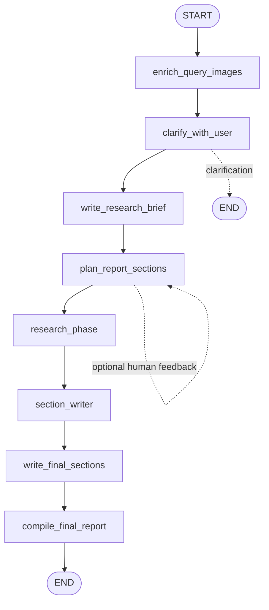
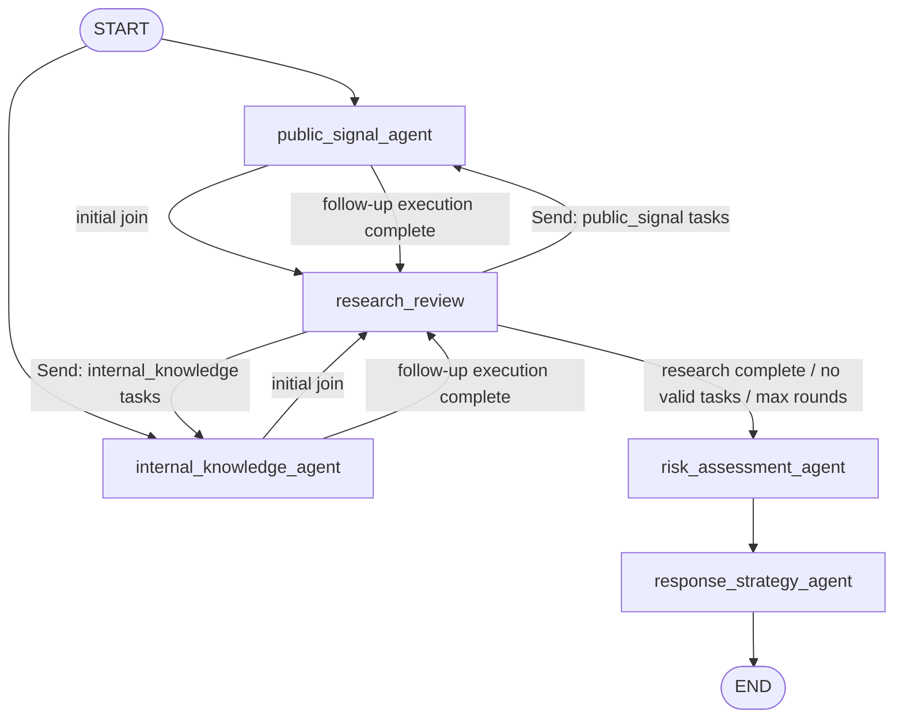

# Architecture Optimization Log

> This is a living architecture decision record for the `public_opinion_research` project. Add new optimization entries and decisions to this file as the architecture evolves. Preserve historical decisions; when a decision changes, mark the earlier ADR as superseded and link the replacement.

- **Status:** Active
- **Scope:** Public Opinion research workflow, agent orchestration, state contracts, evidence flow, and operational boundaries
- **Last updated:** 2026-09-02
- **Primary implementation:** [`src/open_deep_research/deep_researcher.py`](../src/open_deep_research/deep_researcher.py)

## How to Maintain This Log

Each future architecture change should append an entry containing:

1. Date and change scope.
2. Problem or constraint that motivated the change.
3. Decision and affected layers.
4. Alternatives considered and why they were rejected.
5. Positive, negative, and neutral consequences.
6. Tests, observability signals, migration notes, and follow-up work.

An optimization is not complete until the architecture, state contract, failure behavior, and operational implications are documented together.

## Current Architecture

### Project Positioning

The project is an enterprise public-opinion analysis and deep-research Agent. It combines current public signals, internal organizational knowledge, claim and risk analysis, and response strategy into a structured monitoring report.

The system is intentionally specialized for the `public_opinion_risk` business scenario. Generic research-mode routing and an independent Supervisor Agent are not part of the current architecture.

### Layer Model

The workflow has three distinct orchestration layers:

| Layer | Responsibility | Typical lifecycle |
| --- | --- | --- |
| Main graph | Report structure and final report assembly | Brief → Report Plan → Research Phase → Section Writing → Compile |
| Public Opinion subgraph | Evidence acquisition and evidence-gap recovery | Initial Research → Review → Follow-up Research → Review → Risk |
| Business Agent node | Role-specific evidence work | Assignment → ReAct tool loop → Compression → Role report |

`State` is the contract between these layers. The main `AgentState` carries report planning and final-output data. `PublicOpinionState` carries the subgraph's shared reports, private memories, research-review state, task history, and usage observations.

### Main Graph: Relatively Static Report Plan-and-Execute

The main graph plans the report structure once and then executes the research and writing phases. The report plan is deliberately not part of the dynamic evidence-gap loop.



`research_phase` is a state-conversion wrapper around the Public Opinion subgraph. It is not a Supervisor Agent, Planner Agent, or research dispatcher.

### Public Opinion Subgraph: Dynamic Research Plan-and-Execute

The first two research Agents start in parallel. The `research_review` node is a normal graph node that uses one structured-output LLM call to evaluate the evidence already collected. It does not call search, RAG, MCP, or other retrieval tools.



The dynamic cycle is:

```text
Initial Research
  → Research Review
  → Evidence Gap
  → Send Follow-up Tasks
  → Formal Agent ReAct
  → Research Review
  → Risk Assessment
```

The follow-up route uses LangGraph `Send` to re-enter the existing `public_signal_agent` and `internal_knowledge_agent` nodes. Tasks for the same role are grouped into one Send, while public and internal Sends run independently and fan in before the next Review.

### Business Agent Execution

Each business Agent owns a role contract, prompt, tool policy, input/output contract, private memory policy, and execution strategy. The node reuses the existing ReAct-style loop:

```text
Assignment
  → LLM response
  → Tool calls
  → Tool results
  → LLM response
  → ...
  → Compressed role report
```

Current role topology:

```text
public_signal + internal_knowledge
            → risk_assessment
            → response_strategy
```

Role boundaries remain explicit:

- `public_signal`: public news, official notices, social discussion, complaints, spread, competitor/category context, and public timelines.
- `internal_knowledge`: cited company, product, policy, FAQ, playbook, prior-incident, and internal-memory evidence.
- `risk_assessment`: claim verification, risk register, risk level, drivers, mitigators, confidence, and unresolved uncertainty.
- `response_strategy`: response posture, holding statements, FAQ points, stakeholder messages, actions, and monitoring keywords.

### State and Evidence Flow

The principal state fields are defined in [`src/open_deep_research/state.py`](../src/open_deep_research/state.py).

| State field | Purpose |
| --- | --- |
| `research_brief` | Scope and target of the current research run |
| `role_reports` | Complete role reports; follow-up reports are appended rather than overwriting earlier evidence |
| `agent_memories` | Compact role-private context, separated by role |
| `research_round` | Current research round; starts at `1` and advances for follow-up execution |
| `research_review` | Structured Review result and current evidence-gap assessment |
| `current_research_tasks` | Tasks assigned to the current follow-up Agent execution |
| `completed_research_tasks` | De-duplicated task history used to avoid repeated work |
| `budget_usage` | Model, tool, search, and token usage observations |

`ResearchTask` contains a stable ID, objective, target role, evidence needed, reason, and priority. `ResearchReview` contains confirmed findings, unresolved claims, conflicts, research gaps, and executable next tasks.

Downstream `risk_assessment_agent`, `response_strategy_agent`, and `section_writer` receive the full combined role reports. Risk and response Agents also receive the latest structured Review so unresolved claims and conflicts remain visible after routing.

## Completed Optimizations

### Baseline Architecture Clarification — 2026-09-02

The following architecture optimizations are complete and form the current baseline:

- Clarified the project positioning as **enterprise public-opinion analysis + deep-research Agent**.
- Clarified the hierarchy between the main graph, the Public Opinion subgraph, graph Nodes, business Agents, and State.
- Renamed the misleading `research_supervisor` wrapper to `research_phase`; the current project has no independent Supervisor Agent.
- Established the compact multi-Agent topology: `public_signal + internal_knowledge → risk_assessment → response_strategy`.
- Kept a ReAct-style Tool Loop inside each business Agent.
- Kept the main graph's Report Plan-and-Execute relatively static.
- Added Dynamic Research Plan-and-Execute inside the Public Opinion subgraph:
  `Initial Research → Research Review → Evidence Gap → Send Follow-up Tasks → Agent ReAct → Review`.
- Added `ResearchTask`, `ResearchReview`, `research_round`, `research_mode`, current task state, and completed task state.
- Used LangGraph `Send` to route follow-up work back to formal Agent Nodes.
- Deliberately did not add a Supervisor Agent, Planner Agent, `FollowupResearchAgent`, or `dispatch_followup_research` Node.
- Defined `max_research_rounds` as a workflow safety limit for preventing infinite loops; it is not a token or usage budget.
- Kept Budget as an Observability/Usage Tracking concern for the dynamic research route; Budget does not decide whether the research loop continues or stops.
- Extended Observability topology and model-call components so Review, initial research, and follow-up role execution can be distinguished.
- Preserved complete multi-round role evidence for Risk Assessment, Response Strategy, and Section Writer instead of allowing follow-up output to replace first-round output.

### Implementation References

- State models and reducers: [`state.py`](../src/open_deep_research/state.py)
- Dynamic Review, routing, Send payloads, and subgraph topology: [`deep_researcher.py`](../src/open_deep_research/deep_researcher.py)
- Workflow safety configuration: [`configuration.py`](../src/open_deep_research/configuration.py)
- Research Review prompt: [`prompts.py`](../src/open_deep_research/prompts.py)
- Observability: [`observability/langsmith.py`](../src/open_deep_research/observability/langsmith.py) (historical note: this phase originally referenced a separate `agent_observer.py` sidecar; that integration has since been removed entirely, marked historical/removed)
- Dynamic loop regression coverage: [`test_public_opinion_research_loop.py`](../tests/test_public_opinion_research_loop.py)

## Design Decisions

### ADR-001: Position the System as an Enterprise Public-Opinion Research Agent

**Status:** Accepted

#### Context

The system needs to combine external public signals with organization-side knowledge and turn evidence into risk-aware response guidance. A generic research assistant abstraction would hide the business boundaries that govern tools, prompts, evidence quality, and downstream decisions.

#### Decision

Treat `public_opinion_risk` as the current product workflow: public signal collection, internal knowledge retrieval, risk assessment, response strategy, and structured report generation.

#### Consequences

**Positive**

- Prompts, tools, state, and evaluation criteria can be aligned to enterprise public-opinion decisions.
- Role ownership and evidence provenance are easier to inspect.

**Negative**

- Generic research use cases are outside the current product contract.
- New business scenarios require an explicit architecture decision rather than an implicit mode branch.

**Neutral**

- Retired implementations remain available in Git history, not in the active source tree.

#### Alternatives Considered

- **Generic multi-purpose research mode:** rejected because it obscured business-specific evidence and tool boundaries.
- **Several independent business scenarios in one graph:** deferred until a separate state and routing contract is defined.

#### References

- [`configuration.py`](../src/open_deep_research/configuration.py)
- [`public_opinion_agents/`](../src/open_deep_research/public_opinion_agents/)

### ADR-002: Keep Three Orchestration Layers Explicit

**Status:** Accepted

#### Context

Report structure planning, evidence-gap recovery, and role-specific retrieval solve different problems. Combining them creates unclear ownership and makes graph behavior difficult to observe and test.

#### Decision

Maintain three layers: the main Report Plan-and-Execute graph, the dynamic Public Opinion research subgraph, and the ReAct loop inside each formal business Agent.

#### Consequences

**Positive**

- Each layer has a narrow responsibility and a clear state boundary.
- Main report structure can remain stable while evidence acquisition evolves.
- Agent tool policies remain role-specific.

**Negative**

- State conversion between the main graph and subgraph must be maintained carefully.
- A change that crosses layers requires coordinated tests.

**Neutral**

- `research_phase` is intentionally a wrapper/state boundary rather than an orchestration persona.

#### Alternatives Considered

- **One large supervisor loop:** rejected because it conflates report planning, evidence collection, and tool execution.
- **Independent Agent graphs with no shared review layer:** rejected because evidence gaps would not have a single decision point.

#### References

- [`deep_researcher.py`](../src/open_deep_research/deep_researcher.py)
- [`state.py`](../src/open_deep_research/state.py)

### ADR-003: Use `research_phase` Instead of `research_supervisor`

**Status:** Accepted

#### Context

The previous wrapper name implied an independent Supervisor Agent. The current implementation only invokes the Public Opinion subgraph and converts state between the main graph and the subgraph.

#### Decision

Name the wrapper `research_phase` and document that no independent Supervisor Agent exists in the current workflow.

#### Consequences

**Positive**

- Names match runtime responsibility.
- Observability and architecture diagrams no longer imply a hidden coordinator.

**Negative**

- Existing integrations or documentation using the old name require migration.

**Neutral**

- The subgraph still has explicit graph routing; removing a persona does not remove orchestration.

#### Alternatives Considered

- **Keep `research_supervisor` as a compatibility alias:** rejected because the misleading name would remain visible in the main architecture.
- **Rename it to `public_opinion_subgraph_runner`:** rejected as overly implementation-oriented for a business workflow phase.

#### References

- [`deep_researcher.py`](../src/open_deep_research/deep_researcher.py)
- [`agent-loop.md`](architecture/agent-loop.md)

### ADR-004: Keep Report Planning Static and Research Planning Dynamic

**Status:** Accepted

#### Context

The report outline answers “what sections should the final report contain,” while research review answers “what evidence is still needed.” Making the report planner dynamically re-plan during retrieval would make section order, writing dependencies, and human review unstable.

#### Decision

Run `plan_report_sections` as a relatively static main-graph phase. Put dynamic Plan → Execute → Review → Re-plan behavior only inside the Public Opinion research subgraph.

#### Consequences

**Positive**

- Report structure remains predictable and reviewable.
- Evidence depth can adapt without changing the final document contract.
- Section Writer receives a stable section plan plus complete evidence.

**Negative**

- A newly discovered evidence dimension does not automatically become a new report section.
- The Review prompt must identify whether a gap affects evidence quality or report structure.

**Neutral**

- Future section-plan changes can be introduced as a separate architectural decision.

#### Alternatives Considered

- **Dynamic Section Planner in the main graph:** rejected because it mixes document structure with retrieval uncertainty.
- **No research review:** rejected because fixed research can leave material claims unverified.

#### References

- [`plan_report_sections`](../src/open_deep_research/deep_researcher.py)
- [`research_review_prompt`](../src/open_deep_research/prompts.py)

### ADR-005: Reuse Formal Agent Nodes with LangGraph `Send`

**Status:** Accepted

#### Context

Follow-up research must preserve the same tool whitelist, ReAct lifecycle, observability, and role contract as initial research. A separate dispatcher or follow-up Agent would duplicate those boundaries.

#### Decision

`research_review` groups `ResearchTask` objects by `target_role` and returns LangGraph `Send` packets to the existing `public_signal_agent` and `internal_knowledge_agent` nodes. Same-role tasks are batched into one Send. Follow-up Agent executions route back to Review and fan in before the next decision.

#### Consequences

**Positive**

- LangGraph topology and Agent lifecycle remain visible.
- Tool permissions and ReAct behavior are reused rather than reimplemented.
- One role does not start multiple duplicate Agent loops for a batch of tasks.

**Negative**

- Send payloads must explicitly carry the state needed by the formal Agent.
- Initial joins and dynamic fan-in require dedicated regression tests.

**Neutral**

- `research_review` is an LLM-backed graph node but not a business Agent.

#### Alternatives Considered

- **`dispatch_followup_research` Node:** rejected because routing can be expressed directly by Review plus conditional edges plus Send.
- **`FollowupResearchAgent`:** rejected because it would duplicate role prompts, tools, and lifecycle behavior.
- **Directly calling `_run_public_opinion_agent` inside the router:** rejected because it bypasses graph topology and observability.

#### References

- [`deep_researcher.py`](../src/open_deep_research/deep_researcher.py)
- [LangGraph Send documentation](https://langchain-ai.github.io/langgraph/concepts/low_level/#send)

### ADR-006: Preserve Multi-Round Role Reports in the Shared Evidence Channel

**Status:** Accepted

#### Context

Follow-up research answers a gap but does not invalidate the evidence from the initial round. Replacing a role's report would hide first-round context from Review, Risk Assessment, Response Strategy, and Section Writer.

#### Decision

Keep the existing `role_reports: dict[str, str]` downstream contract and change its reducer so a new report for an existing role is appended with an explicit additional-research separator. Keep compact private memories separately under `agent_memories`.

#### Consequences

**Positive**

- Existing downstream prompts continue to receive strings.
- Initial and follow-up evidence remain available to every downstream consumer.
- Private-memory truncation cannot erase formal evidence.

**Negative**

- Role reports can grow across rounds and require prompt-size management.
- Consumers that need report-level metadata must parse the separator or use future structured history.

**Neutral**

- `completed_research_tasks` is task history, not an Evidence Pool; a full Evidence Pool remains a future topic.

#### Alternatives Considered

- **Replace the role report on every round:** rejected because it loses evidence.
- **Change `role_reports` to `dict[str, list[str]]` immediately:** deferred because it would require broader downstream prompt and writer changes.
- **Introduce a full Evidence Pool:** deferred to a dedicated architecture decision.

#### References

- [`role_reports_reducer`](../src/open_deep_research/state.py)
- [`test_public_opinion_research_loop.py`](../tests/test_public_opinion_research_loop.py)

### ADR-007: Use `max_research_rounds` as a Workflow Safety Limit

**Status:** Accepted

#### Context

A Review model must be allowed to request material follow-up work, but a defective prompt, model, or reducer must not create an unbounded loop. Usage counters answer an observability question and are not a reliable semantic definition of evidence completeness.

#### Decision

Start at `research_round=1`. Allow Review to schedule follow-up work only while the configured `max_research_rounds` has not been reached. Default to `2`, meaning one initial round plus at most one supplementary round. Do not use Budget, token cost, model-call count, or tool-call count as the dynamic loop's semantic stop condition.

#### Consequences

**Positive**

- The loop has a deterministic safety boundary.
- Research completeness remains a Review/evidence decision.
- Parallel follow-up Agents can merge their round number safely.

**Negative**

- A material gap discovered after the safety limit remains unresolved and must be surfaced to Risk Assessment.
- The limit is a workflow trade-off and may need tuning for different research domains.

**Neutral**

- Budget metrics continue to be carried and recorded for Observability/Usage Tracking.

#### Alternatives Considered

- **Stop when Budget is exceeded:** rejected because cost does not determine whether evidence is sufficient.
- **Restore `max_researcher_iterations`:** rejected because it belonged to the removed Supervisor loop and did not express evidence-driven completion.
- **No safety limit:** rejected because an invalid Review loop could run indefinitely.

#### References

- [`max_research_rounds`](../src/open_deep_research/configuration.py)
- [`route_after_research_review`](../src/open_deep_research/deep_researcher.py)

## Rejected Alternatives

The following alternatives are intentionally outside the current architecture:

| Alternative | Rejection reason |
| --- | --- |
| New Supervisor Agent | Duplicates graph orchestration and obscures the explicit state-driven topology. |
| New Planner Agent | Research Review is sufficient for gap assessment; role Agents execute the work. |
| `dispatch_followup_research` Node | Adds a routing-only node without adding domain responsibility. |
| `FollowupResearchAgent` | Duplicates the existing public and internal Agent contracts. |
| Dynamic main-graph Section Planner | Makes report structure unstable and mixes document planning with evidence retrieval. |
| New MCP Server or a reworked Tool system | Not required for the research loop and would expand scope. |
| Complete Evidence Pool | Valuable, but requires separate provenance, deduplication, retention, and citation decisions. |
| Budget-driven loop stopping | Usage is not a semantic evidence-completeness signal. |
| Simple role-report overwrite | Loses first-round evidence and weakens downstream verification. |

## Next Optimization Topics

These topics are intentionally recorded as a backlog for future architecture entries. Each should become a dedicated decision or design note before broad implementation.

### MCP / Tool Governance

- Define ownership and lifecycle for MCP servers and tools.
- Formalize per-role allowlists, domain classification, read/write boundaries, and failure behavior.
- Decide how tool versions, availability, latency, and provenance appear in Observability.

### Deep-Research Context Management and Compression

- Define context budgets for Review, Agents, Risk Assessment, and Section Writer.
- Preserve high-value claims, citations, conflicts, and unresolved gaps when compressing.
- Establish truncation rules that are deterministic and testable across multi-round runs.

### Evidence Management

- Evaluate whether to introduce a structured Evidence Pool.
- Define claim IDs, source provenance, timestamps, confidence, deduplication, conflict representation, and citation handoff.
- Separate raw retrieval artifacts, role reports, verified claims, and report-ready evidence.

### RAG / Memory Boundaries

- Clarify what belongs in knowledge-base retrieval, durable memory, private Agent memory, and current-run state.
- Define freshness, citation, deletion, and stale-memory handling policies.
- Prevent public evidence from being mistaken for internal company facts and vice versa.

### Multi-Agent Information Transfer

- Evaluate structured handoff schemas in addition to role-report text.
- Define which findings are shared, which memories remain private, and how conflicts are escalated.
- Add explicit contracts for Risk Assessment and Response Strategy inputs.

### Research Evaluation

- Add evaluation cases for evidence-gap detection, unnecessary follow-up avoidance, conflict handling, and max-round behavior.
- Measure research completeness separately from report prose quality.
- Track tool provenance, citation correctness, role boundary violations, and follow-up precision/recall.

## Future Entry Template

Copy this template when recording the next material architecture change:

```markdown
### [Optimization title] — YYYY-MM-DD

#### Problem / Context

What constraint, failure mode, or opportunity motivated the change?

#### Decision

What changed, which layers are affected, and which invariants remain unchanged?

#### Consequences

**Positive**

- ...

**Negative**

- ...

**Neutral**

- ...

#### Alternatives Considered

- **Alternative:** why it was rejected, deferred, or selected.

#### Validation and Observability

- Tests:
- Metrics/traces:
- Failure modes:

#### Follow-up

- ...
```

## Change History

| Date | Entry | Status |
| --- | --- | --- |
| 2026-09-02 | Established the project positioning, layer model, dynamic Public Opinion research loop, state contracts, Send routing, role-report preservation, and workflow safety boundary. | Accepted |

### Single-Case Cost Observation — 2026-09-02

#### Context

The fixed regression case is 'cost_case_tesla_safety_public_opinion' from 'evaluation/cost_profile/single_case.json'. The comparison used '5989480' (After) and 'd0270b6' (Before), one run each, with the actual configured model 'deepseek:deepseek-chat'.

The raw '.env' left RAG disabled, which made 'internal_knowledge_agent' fail before a complete run. For this cost observation, both versions used the same local public-opinion RAG fixture configuration. No business code, prompt, ReAct limit, research-round limit, tool whitelist, or RAG algorithm was changed.

#### Findings

- After used 233 model calls and 60 tool calls over 642.46 seconds. Before used 135 model calls and 46 tool calls over 493.97 seconds.
- Known token subtotal was 1,332,387 for After versus 827,944 for Before: +504,443 known tokens, or about +60.9%. Exact totals were unavailable because the provider omitted usage fields for 192 After calls and 104 Before calls. These missing calls are mostly webpage summarization and structured-output calls, so the real difference may be larger.
- 'public_signal_agent' is the main known-token cost center. It used 190 model calls in After versus 81 in Before. The largest count and time driver was 'webpage_summarization': 187 calls in After, with about 1,051.8 seconds of cumulative model-call duration. Its token usage was not exposed, so this is a high-priority investigation target.
- ReAct history grows continuously because new AI and Tool Result messages remain in the next prompt. In After, 'public_signal' Round 2 input grew from 8,170 to 96,307 tokens. Similar growth appears in the other agents.
- 'compress_research' is not cheap: 6 calls in After versus 4 in Before. After's known compression subtotal was 298,064 tokens, about 22.37% of its known token subtotal.
- The same 'role_reports' are injected into Research Review, Risk Assessment, Response Strategy, and Section Writer. Character-based estimation puts After repeated role-report input at roughly 171,151 tokens; this is estimated because prompt provenance was not captured.
- Dynamic Research is not expensive because of the Review call itself. The direct loop overhead was 2 Research Review calls plus 132 public/internal follow-up calls, with at least 629,027 known tokens. The follow-up agents effectively perform another broad research pass instead of returning a small evidence delta.

#### Decision

Keep Dynamic Plan-and-Execute. The loop is working:

Research → Review → Gap → Follow-up → Review

The problem is the Execute granularity, not the existence of the loop. Follow-up should move from:

Research Gap → broad second research pass

to:

Research Gap → narrow gap-specific retrieval → Evidence Delta → Review

The follow-up output should contain only newly found evidence, citations, unresolved conflicts, and task status. It should not rebuild the full role report unless explicitly required.

#### Optimization Priority

1. **P0 — Excessive webpage summarization.** Find out why one Case generated 187 webpage-summary calls. Remove duplicate, low-value, or transitively repeated page summarization before changing model settings.
2. **P0 — ReAct history growth.** Stop resending the full accumulated Tool Result history when a compact evidence state can preserve the decision-relevant facts.
3. **P0 — Follow-up granularity.** Make follow-up Agents execute only the Review task's narrow evidence request and return an Evidence Delta.
4. **P1 — Compression cost.** Measure whether each 'compress_research' call saves more downstream input tokens than it consumes.
5. **P1 — 'role_reports' duplication.** Replace repeated full-report injection with targeted claims, citations, conflicts, and unresolved gaps.
6. **P1 — Section Writer evidence duplication.** Check whether multiple sections receive the same role evidence and amplify the final writing prompt.

#### Regression Rule

Do not expand the Benchmark yet. Keep 'single_case.json' as the cost regression case. After each optimization, compare:

- Model Calls and Tool Calls
- Input, Output, and Total Tokens
- Duration
- Maximum ReAct input length
- Research Gap detection
- Follow-up evidence completion
- Final research quality

The goal is not token reduction by itself. The goal is to remove repeated search, repeated context, and oversized follow-up execution while preserving deep-research coverage and gap recovery.
