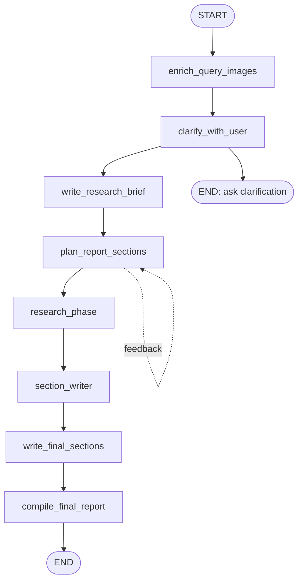
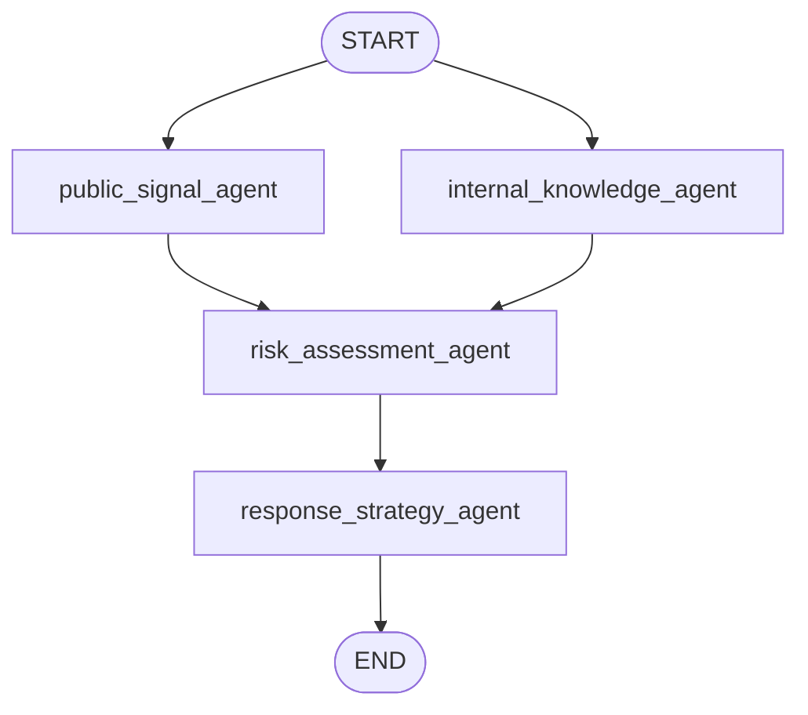

# Agent Loop 模块说明

## 本页速览

| 项目 | 内容 |
| --- | --- |
| 阅读目标 | 理解主图如何生成 research brief、执行 Public Opinion 多 Agent 子图并编译最终报告 |
| 关键代码 | `src/open_deep_research/deep_researcher.py`、`state.py`、`utils.py`、`budget.py` |
| 上游文档 | [当前技术栈说明](technical-stack.md) |
| 下游文档 | [Tools 模块说明](tools.md)、[RAG 模块说明](rag.md)、[Memory 模块说明](memory.md) |

当前实现只有主图和一个 Public Opinion 子图。主图中的
`research_phase` 是子图的状态转换包装节点，不是负责规划或委派任务的
Supervisor Agent。

## 1. 模块定位

Agent loop 负责把用户输入转换成研究简报，规划报告章节，执行固定的
Public Opinion 四 Agent 工作流，使用工具/RAG/web/MCP 获取证据，并生成最终报告。

核心文件：

- `src/open_deep_research/deep_researcher.py`
- `src/open_deep_research/state.py`
- `src/open_deep_research/prompts.py`
- `src/open_deep_research/utils.py`
- `src/open_deep_research/budget.py`

主导技术：

- LangGraph `StateGraph`
- LangChain chat model
- LangChain tool calling
- `Command(goto=..., update=...)` 路由

## 2. Graph 结构

### 2.1 主图



### 2.2 Public Opinion 子图



固定业务拓扑为：

```text
public_signal_agent + internal_knowledge_agent
    -> risk_assessment_agent
    -> response_strategy_agent
```

其中前两个 Agent 并行启动；风险评估等待两者完成；处置策略等待风险评估完成。

## 3. State 定义

位置：`src/open_deep_research/state.py`

### 3.1 `AgentState`

主图状态包括：

| 字段 | 含义 |
| --- | --- |
| `messages` | 用户和主图消息 |
| `research_brief` | 研究简报 |
| `role_reports` | 当前运行中四个业务角色的完整报告 |
| `agent_memories` | 按角色隔离的紧凑私有记忆 |
| `raw_notes` | 原始工具/Agent 输出 |
| `notes` | 研究结果和报告编译使用的笔记 |
| `budget_usage` | 模型、工具、搜索和 token 预算使用情况 |
| `sections` | 规划的报告章节 |
| `completed_sections` | 已完成的章节 |
| `feedback_on_report_plan` | 章节计划反馈 |
| `final_report` | 最终报告 |

### 3.2 `PublicOpinionState`

子图状态只保留执行四个业务 Agent 所需的转换字段：

| 字段 | 含义 |
| --- | --- |
| `messages` | 用户消息 |
| `research_brief` | 研究简报 |
| `role_reports` | 角色报告，供下游角色读取 |
| `agent_memories` | 按角色隔离的紧凑记忆 |
| `notes` | 角色报告汇总 |
| `raw_notes` | 原始工具输出 |
| `budget_usage` | 子图预算使用情况 |

## 4. Reducer 规则

### 4.1 `override_reducer`

默认把 list 追加；如果新值是：

```python
{"type": "override", "value": ...}
```

则直接覆盖旧值。它用于覆盖本轮 raw notes 和最终需要清理的 notes。

### 4.2 `role_reports_reducer`

角色报告按角色名合并。`research_phase` 使用 override 更新主图中的完整
当前运行报告，避免旧运行的报告混入本轮结果。

### 4.3 `agent_memories_reducer`

私有记忆按角色追加；`research_phase` 以 override 形式把子图结果写回主图，
保证每个角色的记忆槽位彼此隔离。

### 4.4 `budget_usage_reducer`

通过 `merge_budget_usage(...)` 累加预算；传入 override 时重置为指定值。

## 5. 主图节点

### 5.1 `enrich_query_images`

- 在规划前识别用户问题中的图片。
- 将图片识别结果作为临时 query context 注入消息。
- 不写入本地知识库或 memory。
- 后续写 memory 时通过 `_messages_without_query_image_context(...)` 排除临时上下文。

启用条件由 `rag_query_image_enabled` 和 `rag_multimodal_enabled` 控制。

### 5.2 `clarify_with_user`

- 判断用户请求是否需要澄清。
- 需要澄清时直接结束本轮并返回问题。
- 不需要澄清时生成确认消息并进入 `write_research_brief`。

当 `allow_clarification=False` 或预算守卫需要保留最终报告调用时跳过模型调用。

### 5.3 `write_research_brief`

- 把用户消息转换成具体的 Public Opinion research brief。
- 将 brief 交给 `plan_report_sections`。
- 预算不足时直接使用原始消息文本作为 brief。

这个节点不初始化任何独立的协调者消息状态；四个业务 Agent 的 prompt 和输入契约
由各自的 `PublicOpinionAgentSpec` 提供。

### 5.4 `plan_report_sections`

- 使用结构化输出规划报告章节。
- 根据可用预算限制研究章节数量，并为章节写作预留调用。
- `allow_plan_feedback=True` 时通过 `interrupt(...)` 等待用户批准或反馈。
- 批准或无需反馈时进入 `research_phase`。

### 5.5 `research_phase`

这是主图进入 Public Opinion 子图的唯一节点。它的职责是：

1. 从 `AgentState` 读取 `messages`、`research_brief`、已有 `agent_memories` 和 `budget_usage`。
2. 构造 `PublicOpinionState` 输入并调用 `public_opinion_subgraph.ainvoke(...)`。
3. 将子图的 `role_reports`、`agent_memories`、`notes`、`raw_notes` 和预算差量转换回 `AgentState`。

它不进行任务规划、工具委派或独立的 Supervisor 推理。

### 5.6 `section_writer`

从完整的 `role_reports` 中按章节的 `agent_role` 提取证据，生成研究型章节。
完整报告与紧凑私有记忆分开传递，避免证据尾部因记忆截断而丢失。

### 5.7 `write_final_sections`

并行撰写 introduction、conclusion 等非研究型章节，并将完成的章节写回状态。

### 5.8 `compile_final_report`

按规划顺序编译章节；当章节缺失或预算不足时，调用 `_fallback_report_generation`
使用 role reports、notes 和 research brief 生成收束结果。

## 6. Public Opinion Agent 执行

四个 Agent 的定义位于 `src/open_deep_research/public_opinion_agents/`，每个定义包含：

- 角色责任边界
- 输入契约和输出 schema
- 可用工具域与工具策略
- 私有记忆策略
- 固定执行和交接策略

### 6.1 `public_signal_agent`

收集新闻、官方通知、社交讨论、投诉、传播信号和竞品/品类上下文。

### 6.2 `internal_knowledge_agent`

从本地 RAG 获取公司事实、产品事实、历史事件、政策、FAQ、PR playbook 和记忆，
并保留本地引用。

### 6.3 `risk_assessment_agent`

核验上游事实，区分 confirmed、disputed、unsupported 和 follow-up 项，并建立风险登记表。

### 6.4 `response_strategy_agent`

基于公共信号、内部证据和风险结果生成 response posture、holding statement、FAQ、
利益相关方消息、行动计划和后续监测关键词。

每个 Agent 在自己的节点内运行最多 `max_react_tool_calls` 轮工具调用；工具调用结束后，
通过 `compress_research` 生成角色报告，并把紧凑摘要写入自己的私有记忆槽位。

## 7. Budget Guard

主图和子图都会在以下阶段检查预算：

- 澄清、brief 生成和章节规划前
- 每个业务 Agent 推理和工具调用前后
- 研究压缩前
- 章节写作和最终报告前

关键策略：

- 默认保留一次最终报告模型调用。
- 超预算工具调用替换为 synthetic `ToolMessage`。
- findings 过长时按剩余 input token 截断。
- 最终报告追加预算摘要。

## 8. Memory 写入集成

`maybe_persist_chat_memory(...)` 在最终报告生成后可选写入：

- 用户和 AI 消息，不包括 query image 临时上下文。
- 最终报告 summary。
- `research_brief` 作为默认 project fact。

启用条件：`rag_memory_write_enabled=True`。Memory 写入失败只记录 warning，不改变报告输出。

## 9. 错误处理策略

总体策略是局部失败后尽量收束流程：

- 工具异常转换为工具结果文本。
- RAG 异常转换为 `Local RAG search failed: ...`。
- MCP 连接失败时不加载对应工具。
- 任一业务 Agent 的失败由主图调用方处理并遵循当前 fallback 策略。
- final report token limit 会截断 findings 并重试。
- memory 写入失败只记录 warning。

## 10. 扩展建议

新增主流程节点时需要：

- 在 `AgentState` 增加必要字段。
- 在 `deep_researcher_builder` 中添加 node 和 edge。
- 明确节点是否消耗模型预算。
- 定义失败时是结束、跳过还是 fallback。

新增 Public Opinion 业务 Agent 时需要同时更新：

- Agent spec 和 registry 顺序。
- `PublicOpinionState` 的输入/输出契约（如有必要）。
- `public_opinion_builder` 的固定依赖边。
- `research_phase` 的状态转换测试。
- Observer topology 和相关文档。
