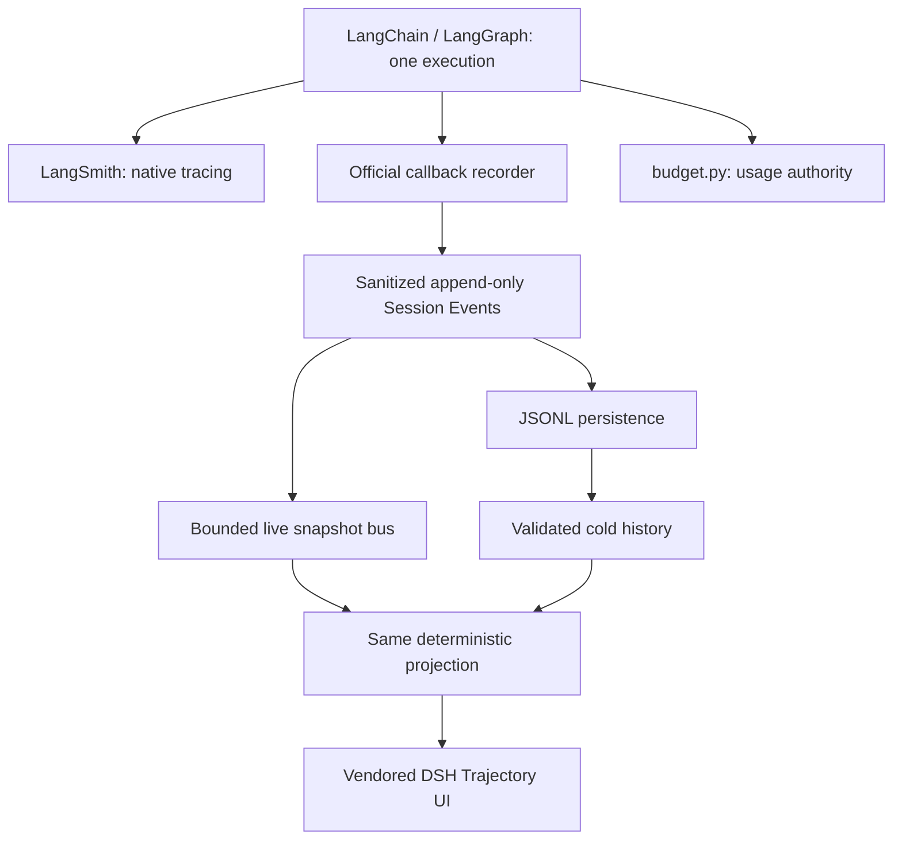

# Conversation Trajectory Ledger

LangSmith owns execution debugging and spans. The Trajectory Session Ledger owns
replayable conversation execution facts. LangGraph owns business state and its
checkpoints; `budget.py` owns accumulated usage and budget policy. The ledger
cannot supply conversation memory, resume business execution, or replace any of
those systems.



## Collection and ownership

The audited runtime is `langchain-core 1.2.22`, `langgraph 1.0.10rc1`, and
`langsmith 0.7.1`. `TrajectorySessionRecorder` is an official
`AsyncCallbackHandler` attached to the same `RunnableConfig` as existing
callbacks. It receives model start, invocation parameters, messages, chunks,
usage, model errors, tool arguments/results/errors, chain parents, tags and
metadata. No production code calls its `on_llm_*` or `on_tool_*` methods.
`astream_events(version="v2")` is retained solely for the existing root
status/report transport. Those dictionaries are not collected a second time.
The graph is invoked exactly once. Sync RAG/model callbacks use the same guarded
collector, with thread-safe publication back to the original SSE event loop.

The only additional business seam is `compaction_transaction` in the shared
micro/rolling compaction implementation. No-op compaction emits nothing; real
transformations record start, actual summary/replacement facts, and end/error.
Micro token removal is labeled an estimate. Agent implementations and individual
tools contain no trajectory emit calls. The shared tool dispatcher preserves the
model's actual `tool_call_id` as native callback metadata without changing tool
arguments, results, decisions, or budget accounting.

## Event contract

Version 1 envelopes carry `session_id`, `seq`, epoch-ms `time`, `type`, and `data`.
Runtime-derived events additionally retain actual `run_id`, `parent_run_id`,
known `parent_ids`, agent and graph-node context. Stable correlation facts
(`thread_id`, `research_run_id`, `logical_run_id`) are recorded at session start
and attached to the original LangSmith invocation. Web conversations use a
random `thread_id` as their session id; user text never generates identity.

Durable vocabulary:

- `session/start`, `session/end`
- `turn/start`, `turn/end`, `step/start`, `step/end`
- `user/message`, `system/message`, `request/header`, `request/context`
- `assistant/message`, `assistant/attempt`
- `tool/call`, `tool/result`, `agent/context`, `workflow/error`
- `retry/scheduled`, `retry/started`
- `compaction/start`, `compaction/summary`, `compaction/end`

`seq` starts at zero and is allocated centrally before append, under a lock.
Readers cannot mutate committed events. An actual user submission opens one
Turn, independently of graph rounds or Agent switches. The storage/session
layer can reopen an existing log and continue Turn numbering; the current Web
POST still starts a new research conversation, without pretending to resume
LangGraph business state.

A Step starts at one real model request and closes after its directly requested
executions settle. Parallel models own distinct explicit Step numbers within
one Turn. Two tools requested by one model share its Step. A tool's canonical
ledger id combines its model run and provider call id, retaining the original
`tool_call_id` separately so providers can reuse ids without collapsing history.
Nested calls use real runtime parent links. Missing ids can join only an
unambiguous declaration with matching enclosing execution scope, name and
arguments. Ambiguous/missing ownership remains `unresolved`; it does not create
a Step. Structured-output function envelopes are preserved as protocol output,
not misclassified as executable tools. Agent-only nodes create no model Steps.

The actual offline integration fixture demonstrates:

```text
Turn 1
  Step 1  internal_knowledge LLM -> rag_search -> nested lookup_document
  Step 2  public_signal LLM -> web_search
  Step 3/4  the respective next LLM requests
  Step 5  risk_assessment LLM
  Step 6  response_strategy LLM
```

Parallel ordering follows callback admission; identities and relationships never
come from a browser counter or the most recently observed Agent/LLM.

## Streams, attempts and usage

Chunks accumulate in the recorder and settle once as `assistant/message` or
`assistant/attempt`, embedding every admitted timed delta boundary. Live
`assistant/stream/start`, `assistant/stream/chunk`, and `assistant/stream/end`
are notification kinds, not durable rows and not durable sequence positions.
Chunk snapshots are throttled to 50 ms. A 10,000-chunk test writes fewer than
20 durable records. Backend-assigned live revisions discard stale worker
notifications at the same durable watermark; they never allocate durable seqs.
Failed attempts, including pre-token errors and cancelled
prefixes, are retained. A hard process loss before settlement loses the
uncommitted stream buffer, as in the upstream settlement design; cold replay
still exposes the unfinished request as interrupted.

TTFT uses model callback start to first nonempty text/reasoning/tool delta.
Empty framing/usage-only chunks and nonstreaming responses produce no TTFT.
Durations and completed replay use recorded clocks only. Missing usage, cache
and reasoning fields remain absent. Per-request usage is provider reported;
SSE report totals and `session/end.budget_usage` come from the accumulated root
`budget.py` state, not the last node delta or a frontend sum.

LangChain input tokens already include cache buckets. The projection marks this
with `inputIncludesCache`; the narrow DSH compatibility seam prevents adding
cache tokens twice. An uncached subtotal is shown only when both cache buckets
were reported. DSH-native disjoint usage continues to retain its original
behavior. Explicit `on_retry` facts and official `retry:attempt:N` tags are
recorded; adjacent unrelated requests are never labeled a retry.

## Persistence, privacy and failure isolation

| Setting | Default | Effect |
| --- | --- | --- |
| `TRAJECTORY_PERSISTENCE_ENABLED` | `true` | Durable local history; false retains only a small process-local cache |
| `TRAJECTORY_STORAGE_DIR` | `.data/trajectory` | UTF-8 `<session-id>.jsonl` plus reusable OS lease files |
| `TRAJECTORY_RETENTION_DAYS` | `30` | Prune expired idle logs on admission/list; `0` disables expiry |

The log can contain prompts, tool arguments/results and model output. Protect
its directory as private application data. `.data/trajectory/` is ignored by
Git. Changing the storage directory requires excluding that directory too.

Redaction happens before persistence and live publication, including nested
credential keys, Bearer tokens, URL passwords, known environment secrets, and
credentials split across stream deltas. Tool payloads default to 64 KiB JSON
previews, model/system content to 256 KiB, and each attempt stream to 4 MiB.
Truncation explicitly records `truncated`/`stream_truncated`, `original_size`,
`limit_bytes` or a depth-limit reason; sizes describe UTF-8 serialized data.
No entire graph state, config, history or retrieved corpus is dumped per step.

A writer holds a nonblocking OS-backed lease for its whole lifecycle. A second
writer is refused; OS locks release on crash. Each append writes a complete
newline-terminated record and flushes the file buffer. Turn/session settlement
and close call `fsync`. Reads validate every complete record, identity, format
and contiguous sequence. Only an incomplete physical final line is excluded,
with `warning=torn_tail`; appending to such a tail is refused. Complete corrupt
records, gaps and unknown formats are not silently swallowed.

Cold projection marks open model/tool/turn brackets interrupted in memory,
without assigning durable synthetic seqs, modifying committed events, or
claiming a successful outcome. It first checks live writer ownership. Active
histories remain running. Stop settles active attempts/tools as cancelled and
persists `turn/end reason=cancelled`, `session/end status=cancelled`. SSE
subscriber disconnects do not cancel, rerun or discard the workflow.

Storage/serialization/projection failures log a safe category and mark
trajectory degraded while research continues once. After a failed append the
writer stops further writes to avoid a noncontiguous disk log; the active
process can still show its bounded sanitized history. A later process may have
only the committed prefix, which is shown as interrupted. A corrupt history API
read is an isolated error, never a reason to reinvoke research.

## HTTP and UI

All endpoints reuse the existing optional local API-token policy:

- `POST /api/research`: one admitted execution; `X-Research-Session-Id` identifies it
- `GET /api/trajectory/sessions`: local identities
- `GET /api/trajectory/sessions/{id}`: latest replay/status
- `GET /api/trajectory/sessions/{id}/events?before_seq=N&limit=100`: older event page
- `GET /api/trajectory/sessions/{id}/stream`: subscribe to the original live task
- `POST /api/research/{id}/cancel`: await backend cancellation settlement

History limits are 1–500. A page includes its cumulative projection back to the
new lower bound, with headers, schemas and parents reconstructed from the full
validated prefix. The frontend only hydrates Map fields and renders the supplied
snapshot. DSH's existing `loadOlder` button consumes real pages. The URL stores
`?session=<id>` so reload reads disk and, if live, reconnects without POSTing a
new research run. When another process owns a live writer, history can still be
read; this local server does not route SSE subscriptions across processes.

The original Table, Timeline, Search, Inspector, primitives, CSS and MIT notices
are retained. Small, documented compatibility changes make layout honor backend
Locations and cached input semantics. Source provenance and exact modified
upstream files are in `frontend/src/trajectory/UPSTREAM.md`.

## Verification and limits

Tests cover append/serialization/redaction, leases, retention, torn/corrupt
records, four real LangGraph roles with offline provider fixtures, parallel and
nested tools, unresolved parents, repeated provider call ids, partial/pre-token
attempt errors, native retries, Stop, sync worker callbacks, complete disk
reload, pagination and failure isolation. The actual official LangSmith tracer
is enabled with a recording HTTP transport in coexistence tests: the tracer and
ledger see the same six LLM and three Tool run ids, with one graph execution.
A fixed event log and its projection are shared with frontend contract tests.

This is a local conversation ledger, not the DSH runtime. It does not implement
DSH forked child sessions, inbox/steering semantics, model-visible surface
replacement, format migrations, cloud query indexes, business resume, or
cross-process SSE routing. JSONL reads validate the full prefix and live updates
send coalesced snapshots; very long sessions will need indexed storage and
incremental projection transport. The cache retains at most eight completed
sessions plus active writers. Existing RAG retrieval/embedding/reranker stages
remain in LangSmith rather than duplicated span records.
