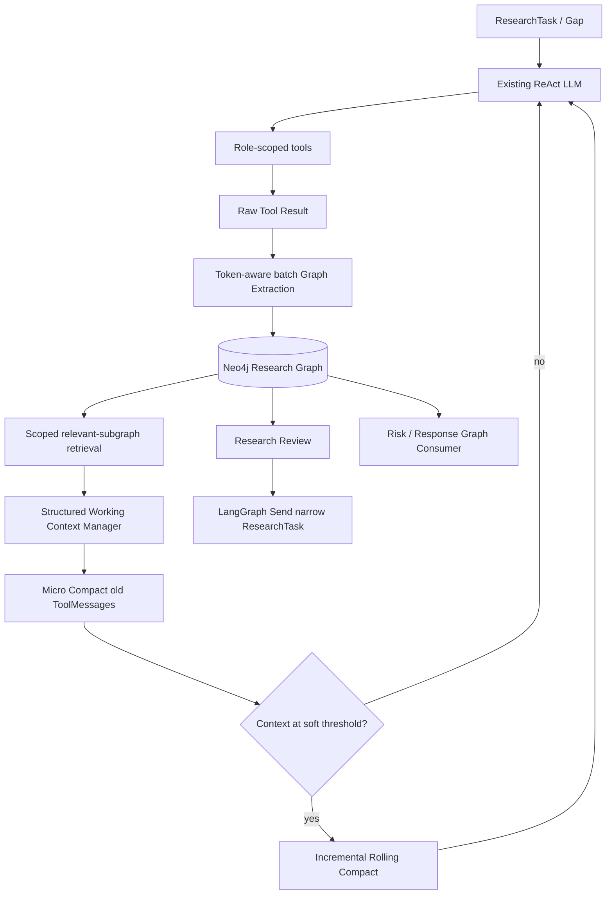

# Research Graph Context Harness

This release adds an opt-in, per-run Research Graph memory layer to the public-
opinion subgraph.  It does not add a fifth business agent or replace the
existing LangGraph ReAct loop.

## Runtime architecture



The three memory layers are separate:

1. Recent raw ReAct messages, with the newest configured steps retained.
2. Bounded `WorkingContext` containing active findings/claims/evidence,
   conflicts, uncertainties, open gaps, and recent progress.
3. Complete Research Graph provenance, retrieved by `run_id` and current task.

## Graph schema

Supported nodes:

`ResearchRun`, `ResearchTask`, `Source`, `Evidence`, `Claim`, `SourceFinding`,
`Event`, `Entity`, `Uncertainty`, `Finding`, and `Coverage`.

Core edges include:

| From | Relation | To |
|---|---|---|
| Evidence | `EXTRACTED_FROM` | Source |
| Evidence | `SUPPORTS` / `CONTRADICTS` / `CONTEXTUALIZES` | Claim |
| SourceFinding | `FROM_SOURCE`, `DERIVED_FROM`, `ABOUT_CLAIM` | Source / Evidence / Claim |
| Claim | `RELATES_TO` / `INVOLVES` | Event / Entity |
| Uncertainty | `APPLIES_TO` / `BASED_ON` | Claim / Evidence |
| Finding | `DERIVED_FROM` / `SUPPORTED_BY` | Claim / Evidence |
| Coverage | `ASSESSES` / `SUPPORTED_BY` | ResearchTask / Finding |

Source metadata (URL, path, title, retrieval time, content hash, tool, query,
role, round, and task) is bound by code.  The extraction model receives
`source_id` references and cannot author source URLs.

## Strategy routing

| AgentSpec | Strategy | Graph behavior |
|---|---|---|
| `public_signal` | `research_graph_producer` | Raw/batch web/social evidence to graph |
| `internal_knowledge` | `research_graph_producer` | Raw/batch RAG evidence to graph |
| `risk_assessment` | `research_graph_consumer` | Retrieve graph evidence for risk analysis |
| `response_strategy` | `research_graph_consumer` | Retrieve graph/risk context for recommendations |

The strategy is selected when the harness is initialized.  `context_strategy`
can override routing for diagnostics; `auto` uses the AgentSpec.  With
`research_graph_enabled=false`, all roles use the compatibility strategy.

## Neo4j and GraphRAG boundary

The project depends on `neo4j-graphrag>=1.19.0,<2.0.0`.  The adapter uses its
typed graph/schema boundary and keeps official retriever/writer/resolver imports
lazy.  Deterministic project Cypher is used for the source-bound delta write so
that `run_id` isolation and the exact provenance contract are enforced in one
place.  This also avoids the experimental KG Builder's default per-chunk LLM
fan-out.  No `GraphRAG()` answer-generation pipeline is used.

## Context lifecycle

- `GraphExtractor`: one structured model call per token-aware batch, not per URL.
- `ContextManager`: one structured update per successfully persisted tool batch;
  all semantic context entries keep graph IDs.
- `Micro Compact`: replaces old persisted `ToolMessage.content` with a receipt;
  it never removes a failed/unpersisted result.
- `Rolling Compact`: triggers around `0.75` of known model capacity and merges
  only the previous rolling summary plus newly compactable steps.  It never
  decides whether research or follow-up work may continue.
- Producer role reports are generated from bounded graph retrieval and Working
  Context, not by calling `compress_research()` on the complete transcript.
- Section writers in Graph mode retrieve section-specific subgraphs instead of
  injecting all role reports into every section.

## Configuration

The important fields are:

```text
research_graph_enabled=false
research_graph_backend=neo4j  # memory for tests
research_graph_uri=bolt://localhost:7687
research_graph_username=neo4j
research_graph_password=<secret>
research_graph_database=<optional>
research_graph_extraction_model=...
context_manager_model=...
rolling_compaction_model=...
context_compaction_threshold_ratio=0.75
recent_raw_steps=3
```

When Graph mode is enabled and the Neo4j connection/schema setup fails, the
workflow raises a clear `ResearchGraphError`.  It does not silently fall back
to standard mode.

## Observability and diagnostics

Graph metrics are emitted in the `research_graph_metrics` state channel with
`exact`, `estimated`, or `unavailable` quality markers where applicable.  They
cover extraction/context/retrieval calls, node/edge writes, cache hits and
duplicates, context size, and both compaction stages.  Raw tool batches and
compaction events can also be written to `.tmp/runtime/transcripts/`; transcript
content is diagnostic only.

## Tests and known limitations

`tests/test_research_graph_context_harness.py` covers strategy routing,
provenance, run isolation, URL/content-hash deduplication, Context Manager
conflicts, ToolMessage-safe Micro Compact, threshold behavior, token-aware
batching, and the graph producer path.  Existing public-opinion regression
tests remain the compatibility guard.

The implementation currently uses exact deterministic IDs for identical source
versions and exact local node IDs; near-duplicate Claim canonicalization and
semantic Entity Resolution are deliberately left behind the official adapter
boundary until the deployment's Neo4j GraphRAG resolver/index configuration is
available.  Cross-run long-term memory is not enabled.
